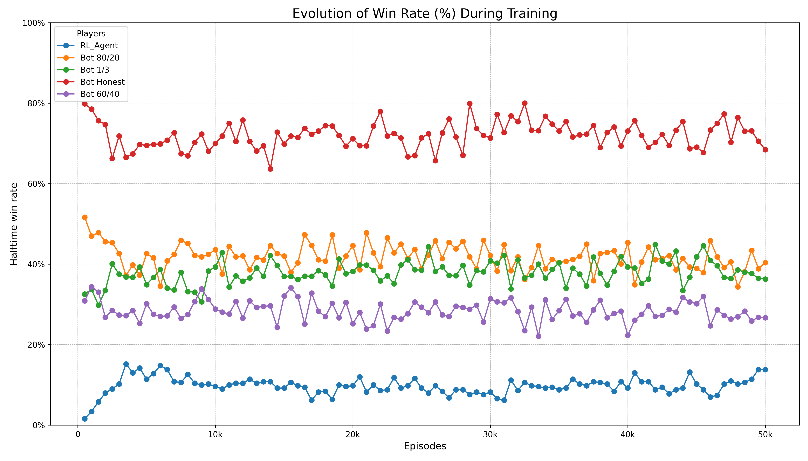
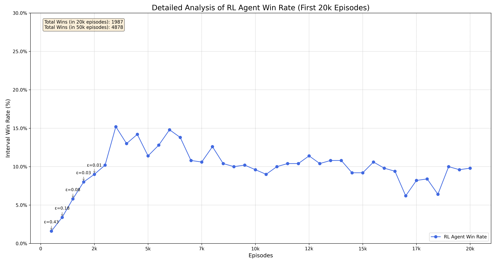
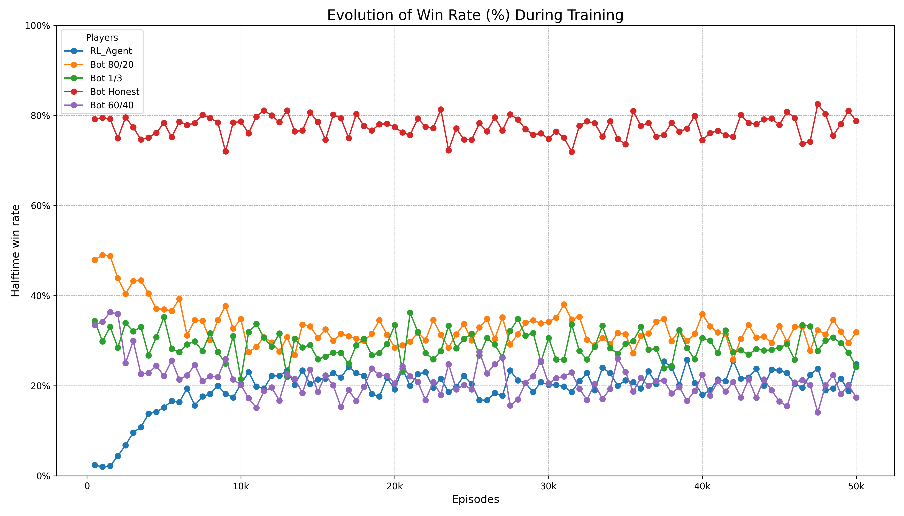
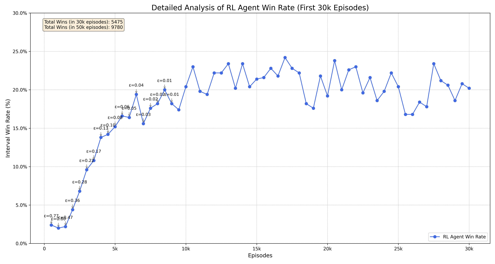
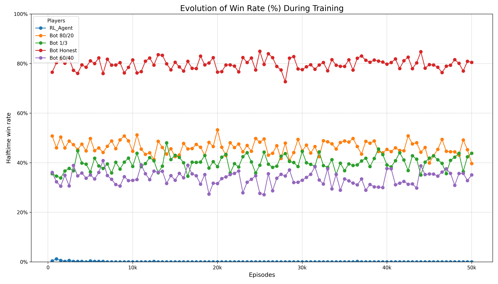
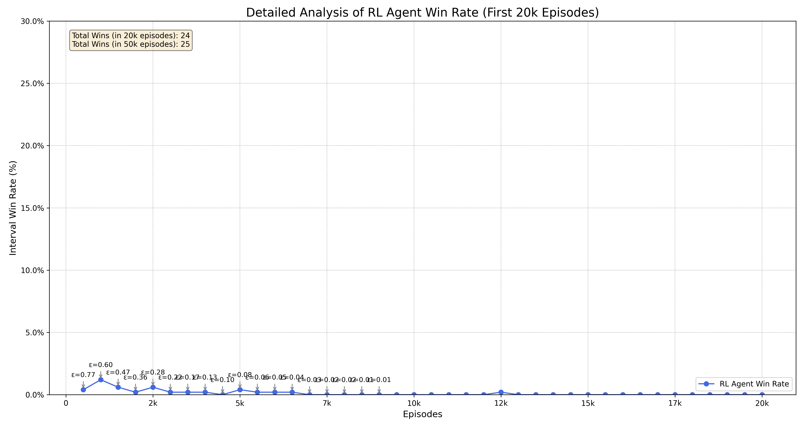
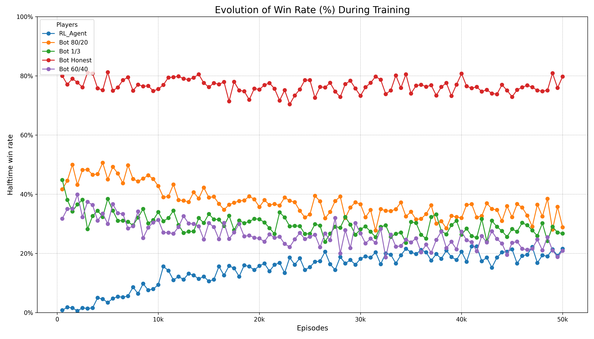
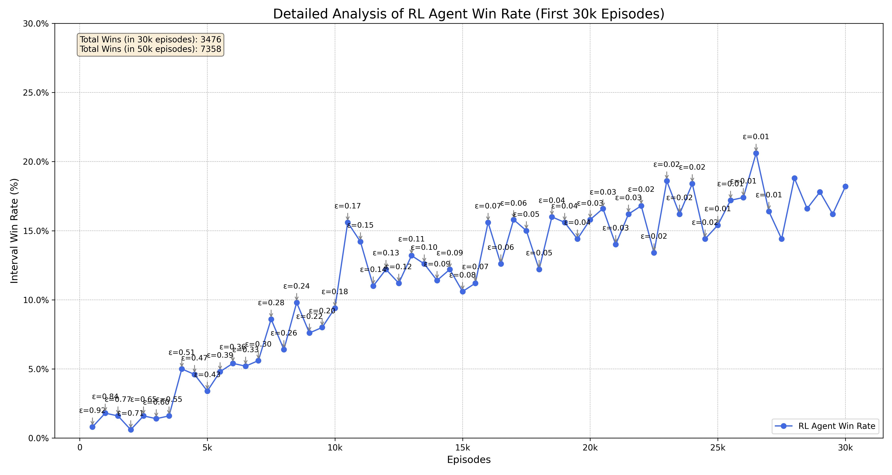

# Phase 1 Report: DQN "Blind" Agent Baseline

**Date:** September 7, 2025

### 1. Abstract

This experimental phase aimed to establish a performance baseline for a Deep Q-Network (DQN) agent in the game of "Cheat". The agent was developed with a "blind" architecture, wherein the neural network head responsible for strategic card selection was disabled. This ablation study forces the agent to learn the game's core mechanics—when to challenge, pass, or play, and what rank/quantity to announce—without the ability to choose which specific cards to use in a bluff. The agent was trained against a pool of four distinct rule-based opponents over 50,000 episodes. To analyze the impact of the exploration-exploitation trade-off, the `epsilon_decay` hyperparameter was varied across three primary training regimes. The results demonstrate that a prolonged exploration phase is critical for this problem, with the best-performing agent achieving a peak win rate of **25.8%**.

### 2. Rationale

#### Why a "Blind" Agent?
The agent is designated as "blind" because one of the four heads of its multi-head neural network—the one responsible for selecting specific cards from the hand—was intentionally not trained. This approach constitutes an **ablation study**, a common methodology in machine learning research. By establishing a performance baseline with this significant handicap, we can later quantify the precise impact and strategic value of intelligent card selection when the fourth head is enabled.

#### Why DQN?
The Deep Q-Network (DQN) algorithm was selected as the initial approach for several strategic reasons. First, as a foundational **value-based** RL algorithm, it establishes a robust and well-understood **baseline**. Its relatively straightforward implementation allows for the isolation of challenges inherent to the game environment, such as the observation space and reward structure, before introducing greater algorithmic complexity. This DQN baseline is crucial for a rigorous comparative analysis against more advanced **policy-based** algorithms like PPO, which are theoretically better suited for Partially Observable Markov Decision Processes (**POMDPs**) like the game of "Cheat".

### 3. Methodology

Three primary experiments were conducted, each starting with random network weights. The environment consisted of 3 players (1 RL Agent, 2 Bots), with the bots being randomly selected each episode from a pool of four distinct strategies. The only hyperparameter varied between the training runs was `epsilon_decay`, designed to control the length of the agent's exploration phase.

* **Training 1: Short Exploration**
    * `epsilon_decay = 0.99995` (ε_min reached at ~2,700 episodes)
* **Training 2: Medium Exploration**
    * `epsilon_decay = 0.999985` (ε_min reached at ~9,000 episodes)
* **Training 3: Long Exploration**
    * `epsilon_decay = 0.999995` (ε_min reached at ~27,000 episodes)

### 4. Results

*The following section will display the comparative learning curves from the experiments.*

**Training Run 1 (Short Exploration)**

**Training Run 2 (Medium Exploration - Best Result)**

**Training Run 3 (Medium Exploration - Learning Failure)**

**Training Run 4 (Long Exploration)**

### 5. Analysis and Conclusions

The experiments yielded several key insights into the agent's learning dynamics based on the quantitative training data.

* **A short exploration phase leads to premature convergence.** The first training run, with the fastest decay, showed rapid initial improvement but quickly stagnated at a low win rate (~15%). This suggests the agent began exploiting a sub-optimal policy too early, failing to discover more robust strategies because its exploration phase was too brief.

* **An optimal balance is key.** The "medium exploration" phase (`decay = 0.999985`) yielded the best result (a peak of 25.8% win rate). This indicates that an exploration phase corresponding to roughly 15-20% of the total training episodes provides an effective balance for this problem, allowing for sufficient discovery without sacrificing the time needed for policy refinement.

* **The Stochastic Nature of Deep RL:** One training run using the most successful `epsilon_decay` parameter resulted in a complete failure, with a win rate never rising above 1%. This highlights the high variance inherent in Deep RL. The combination of **random weight initialization**, the **stochasticity of the initial experiences in the replay buffer**, and the **random sequence of opponents** can, by chance, lead an agent into a poor region of the policy space from which it struggles to escape. This is not a bug, but a well-documented characteristic of the training process.

* **Agent Limitations (The "Honest Bot" Problem):** The "Honest Bot" strategy consistently proved to be the strongest opponent. This is likely because the current agent's state representation is **Markovian**—it has no memory of past turns or player behaviors within an episode. It cannot learn that a specific player is playing honestly and is therefore highly vulnerable to challenges. This reveals a clear limitation and a path for future improvement.

#### Qualitative Analysis of Emergent Strategies

A qualitative analysis of the best-performing model's gameplay revealed several consistent and non-obvious strategies. These behaviors emerged directly from the agent's interaction with the environment and are not explicitly programmed.

* **Risk-Averse Winning Strategy:** The agent developed a distinct approach to mitigate the risk associated with the "Honest Win" rule. Given its inability to guarantee a truthful final move (due to its "blindness"), the agent's policy converged on aggressively discarding cards until only one remained. This increases the probability of its final one-card play being legitimate, thus avoiding the penalty of taking the discard pile.

* **Deterministic Opening Policy:** A fixed opening strategy emerged. When starting the first round of a game, the agent consistently plays six cards and announces the rank "Jack" regardless of its actual hand composition. This suggests the network identified this specific move as having a high expected value over thousands of games, likely for its ability to immediately reduce the hand size and dictate the early-game flow.

* **Aggressive Hand Reduction:** When the adversaries do not have few cards, the agent exhibits a strong policy bias towards playing a large number of cards at once (typically 5 or 6). It consistently prioritizes these large-scale plays over smaller, potentially safer moves, aligning with the primary objective of emptying its hand as quickly as possible.

* **Low-Risk Challenging Behavior:** The agent is significantly more likely to challenge a play when the discard pile is small. This indicates it has learned to correlate the size of the pile with the magnitude of the potential penalty for a failed challenge. It has learned to doubt primarily when the cost of being wrong is minimal.

* **Convergent End-Game Macro-Strategy:** The agent's overall strategy can be described as a two-phase approach:
    1.  An aggressive **"hand-emptying" phase**, where it uses large plays to reduce its hand to a single card.
    2.  A **"control-seeking" phase**, where, holding one card, it frequently makes low-risk challenges to disrupt the game flow and force a new round. The goal of this phase is to become the "starter," which allows it to play its final card and win.

* **Effectiveness in Short vs. Long Games:** The agent's emergent strategy is characteristic of a high-variance or "blitz" approach. It is highly effective in shorter games (e.g., 10-15 turns), where its aggressive plays can overwhelm opponents. However, the policy appears sub-optimal in longer games of attrition, where the probability of accumulating a large discard pile from repeated plays and failed challenges increases, making a win mathematically less likely.

* **State-Dependent Conservatism and Loss Aversion:** A clear policy shift is evident when the agent is in a disadvantageous state (i.e., has a large hand), which implies opponents likely have few cards. In this state, the agent's policy changes from being win-seeking to **loss-averse**. This manifests in two ways:
    1.  It shows a higher tendency to **"Pass"** its turn. From a value-based perspective, the agent has learned that the Q-value of passing is higher than making a risky play. Passing effectively **delays a potential loss** (a large negative reward), whereas a large bluff that gets challenged **accelerates the loss**, resulting in a lower expected cumulative reward.
    2.  When it does play, it plays fewer cards. This appears to be a learned **probabilistic hedge against its own "blindness"**. By playing only one or two random cards, the statistical probability of the play being accidentally truthful is much higher than when playing five or six. This is a sophisticated, risk-mitigating behavior that emerged to compensate for its inability to select cards strategically.

### 6. Next Steps

Given these conclusions, the next phase of the project is clear:

1.  **Enable the Fourth Head:** The immediate next step is to implement and enable the training for the `rank_selection` head. This will allow the agent to move beyond its "blind" state and learn which cards to use when bluffing. The primary hypothesis is that this will significantly increase the agent's performance above the 25.8% baseline.
2.  **Introduce Memory:** To counter predictable strategies like the "Honest Bot", a future iteration could incorporate memory into the agent's network (e.g., using an LSTM layer) or state representation, allowing it to model opponent behavior over the course of a game.

---